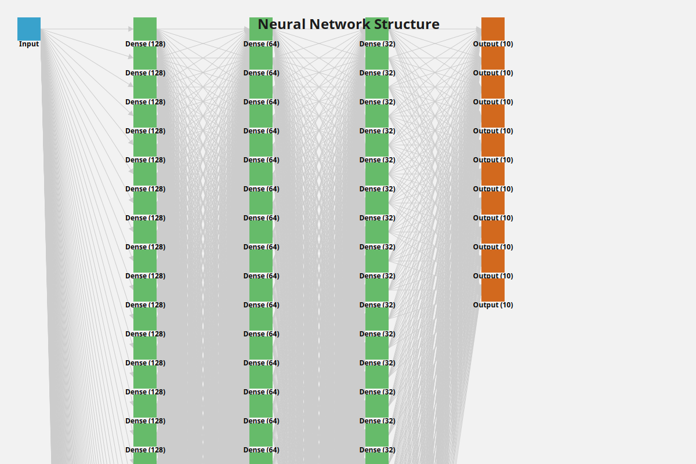

# nnPlot - 神经网络可视化工具库

`nnPlot` 是一个轻量级且高效的 C++ 库，用于可视化神经网络结构。它提供了一个简单直观的 API，可以生成高质量的神经网络架构图，基于cairo 作为渲染后端,并支持导出为 PDF、PNG 和 SVG 等多种格式。

---

## 目录

1. [功能特性](#功能特性)
2. [安装指南](#安装指南)
3. [使用方法](#使用方法)
4. [示例](#示例)
5. [项目结构](#项目结构)
6. [许可证](#许可证)

---
## 示例输出

以下是example生成的神经网络结构图:



## 功能特性

- **神经网络可视化**：轻松可视化神经网络架构。
- **多格式导出**：支持导出为 PDF、PNG 和 SVG 格式。
- **可定制属性**：支持自定义颜色、线宽等视觉属性。
- **轻量高效**：基于现代 C++ 开发，性能优化。
- **跨平台支持**：支持 Linux、macOS 和 Windows。

---

## 安装指南

### 前提条件

- **C++ 编译器**：支持 C++17 或更高版本。
- **CMake**：版本 3.10 或更高。
- **Cairo 库**：用于渲染。

---
### 构建步骤

1. 克隆仓库：
   ```bash
   git clone https://github.com/caomengxuan666/nnPlot.git

   cd nnPlot
    ```
2. 创建构建目录并编译项目：
    ```bash
    mkdir build
    cd build
    cmake ..
    make
    ```

## 使用方法

### 基础示例

以下是一个简单的示例，用于可视化神经网络：
```c++
#include <nnPlot/Model.h>
#include <nnPlot/Exporter.h>

int main() {
    nnPlot::Model model;
    model.addLayer(128, "输入层");
    model.addLayer(64, "隐藏层 1");
    model.addLayer(32, "隐藏层 2");
    model.addLayer(10, "输出层");

    nnPlot::Exporter exporter;
    exporter.exportToPDF(model, "model_structure.pdf");

    return 0;
}
```
### 自定义属性

您可以使用 Property 模块自定义图表的样式：
```cpp
#include <nnPlot/Property.h>

nnPlot::Property::Color layerColor{0.1f, 0.5f, 0.9f}; // RGB 颜色
nnPlot::Property::LineWidth lineWidth{2.0f}; // 线宽
```

或者是
```cpp
    std::unordered_map<std::string, nnPlot::Property::Color> layerColors = {
        { "input", { 0.2f, 0.6f, 0.8f } }, // 输入层颜色
        { "output", { 0.8f, 0.4f, 0.2f } }, // 输出层颜色
        { "fc1", { 0.4f, 0.7f, 0.4f } }, // 隐藏层颜色
        { "fc2", { 0.4f, 0.7f, 0.4f } }, // 隐藏层颜色
        { "fc3", { 0.4f, 0.7f, 0.4f } } // 隐藏层颜色
    };

```


## 项目结构

```plaintext
nnPlot/
├── CMakeLists.txt          # 根 CMake 配置文件
├── LICENSE                 # 许可证文件
├── README.md               # 项目文档
├── docs/                   # 文档文件
├── examples/               # 示例代码
│   ├── CMakeLists.txt      # 示例代码的 CMake 配置
│   ├── example.cpp         # 示例代码文件
│   ├── example_pooling.cpp # 示例代码文件
│   ├── example_shapes.cpp  # 示例代码文件
│   ├── official_draw_example.cpp # 示例代码文件
│   └── preset_conv.cpp     # 示例代码文件
├── include/                # 头文件
│   └── nnPlot/             # 库头文件
│       ├── Concrete_style.h # 具体样式头文件
│       ├── Exporter.h       # 导出模块头文件
│       ├── Layer.h          # 层模块头文件
│       ├── LayoutEngine.h   # 布局引擎头文件
│       ├── Model.h          # 神经网络模型头文件
│       ├── Property.h       # 视觉属性头文件
│       ├── Renderer.h       # 渲染模块头文件
│       ├── Style.h          # 样式头文件
│       ├── StyleFactory.h   # 样式工厂头文件
│       ├── Surface.h        # 表面头文件
│       ├── ThreeD_shape.hpp # 三维形状头文件
│       ├── Utils.hpp        # 工具函数头文件
│       └── concrete_layout.hpp # 具体布局头文件
├── src/                    # 源文件
│   ├── CMakeLists.txt      # 源文件 CMake 配置
│   ├── Concrete_style.cpp  # 具体样式实现
│   ├── Exporter.cpp        # 导出模块实现
│   ├── Layer.cpp           # 层模块实现
│   ├── LayoutEngine.cpp    # 布局引擎实现
│   ├── Model.cpp           # 模型实现
│   ├── Renderer.cpp        # 渲染模块实现
│   └── StyleFactory.cpp    # 样式工厂实现
└── test/                   # 单元测试
    ├── CMakeLists.txt      # 测试 CMake 配置
    └── ExporterTest.cpp    # 导出模块测试用例

## 致谢
Cairo 图形库：提供渲染后端支持。

spdlog：提供日志支持。

fmt: 提供字符串格式化支持

## 说明
本仓库仍然处于开发实验性阶段，很多代码尚未正式完成，或者是尚未重构以符合正式规范。欢迎大家参与讨论和贡献。

## 许可证

本项目基于 MIT 许可证 发布。详情请参阅 LICENSE 文件。

```
MIT License

Copyright (c) 2025 caomengxuan666

Permission is hereby granted, free of charge, to any person obtaining a copy
of this software and associated documentation files (the "Software"), to deal
in the Software without restriction, including without limitation the rights
to use, copy, modify, merge, publish, distribute, sublicense, and/or sell
copies of the Software, and to permit persons to whom the Software is
furnished to do so, subject to the following conditions:

The above copyright notice and this permission notice shall be included in all
copies or substantial portions of the Software.

THE SOFTWARE IS PROVIDED "AS IS", WITHOUT WARRANTY OF ANY KIND, EXPRESS OR
IMPLIED, INCLUDING BUT NOT LIMITED TO THE WARRANTIES OF MERCHANTABILITY,
FITNESS FOR A PARTICULAR PURPOSE AND NONINFRINGEMENT. IN NO EVENT SHALL THE
AUTHORS OR COPYRIGHT HOLDERS BE LIABLE FOR ANY CLAIM, DAMAGES OR OTHER
LIABILITY, WHETHER IN AN ACTION OF CONTRACT, TORT OR OTHERWISE, ARISING FROM,
OUT OF OR IN CONNECTION WITH THE SOFTWARE OR THE USE OR OTHER DEALINGS IN THE
SOFTWARE.
```
